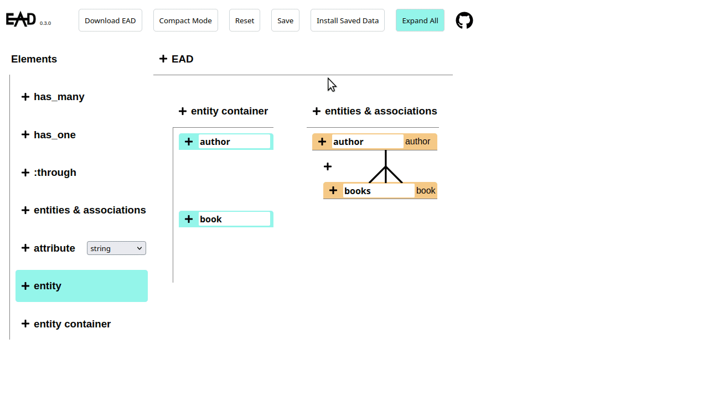

<p align="center">
  
</p>


# ead(Entity Association Diagram gem)

ead is a gem used to generate/modify files of Ruby on Rails projects by using a generated JSON file by EAD. EAD can be accessible from [this repository](https://github.com/ozovalihasan/ead) or [here](https://ead.ozovalihasan.com/) 


## Installation

ead's installation is pretty standard:

```sh
$ gem install ead
```
## Usage

There are two choices to use the generated JSON file;
- Go to the root folder of your Ruby on Rails project.
  ```sh
  $ ead 'path_of_the_generated_file'
  ```
  * Don't forget to put quotation marks('). It is not necessary put quotation marks, if path_of_the_generated_file doesn't include any "(". But, usage of quotation marks is encouraged to be on the safe side. 

- Move the generated JSON file (its name must be 'EAD.json') to the root folder of your project. Then, 
  ```sh
  $ ead
  ```
  
  * If the name of the generated JSON file isn't 'EAD.json',
  ```sh
  $ ead './name_of_the_file'
  ```
  * Don't forget to put quotation marks('). It is not necessary put quotation marks, if path_of_the_generated_file doesn't include any "(". But, usage of quotation marks is encouraged to be on the safe side. 

⚠️: Save your files before running the gem.

⚠️⚠️: Please double-check the generated files by the gem.

⚠️⚠️⚠️: EAD is still under development. So, it is not recommended to use this gem with ongoing projects. 

- If all files are generated as expected,

  ```sh
  $ bundle exec rails db:migrate
  ```

⚠️ An EAD.json file should be generated by using EAD v0.4.0, v0.4.1, v0.4.2, v0.4.3, v0.4.4, v0.4.5 or v0.4.6

## Getting Started


EAD is a tool to initialize any Ruby on Rails project quickly by implementing associations from a generated JSON file.

EAD contains two parts;

- A user interface(called 'EAD') to generate JSON file
- A gem(called 'EAD gem' or 'ead') to modify the files of Ruby on Rails project by using the generated JSON file

This repository contains the code of the EAD gem.

EAD can be accessible from [this repository](https://github.com/ozovalihasan/ead) or [here](https://ozovalihasan.com/ead) 

## Built With

- Ruby
- RSpec

## Supported Versions

The project is developed by using a sample Rails project. Ruby v2.7.2 and Rails v6.1.3.2 are used for this sample project. So, any previous versions of Ruby and Rails may cause some problems.

## Test ead

- Clone this repository
- Open terminal
- Change directory by using `cd ead-g`
- Run `bundle install`
- Run `rspec` to test all files

# Authors

Reach out to me at one of the following places!

👤 **Hasan Özovalı**

- Website: [ozovalihasan.com](https://www.ozovalihasan.com/)
- LinkedIn: [Hasan Özovalı](https://www.linkedin.com/in/hasan-ozovali/)
- Github: [@ozovalihasan](https://github.com/ozovalihasan)
- Twitter: [@ozovalihasan](https://twitter.com/ozovalihasan)
- Mail: [ozovalihasan@gmail.com](mailto:ozovalihasan@gmail.com)


## 🤝 Contributing

Contributions, issues and feature requests are welcome!

Feel free to check the [issues page](https://github.com/ozovalihasan/ead-g/issues).

## Show your support

Give a ⭐️ if you like this project!

## License

[](http://badges.mit-license.org)

- **[MIT license](http://opensource.org/licenses/mit-license.php)**
 