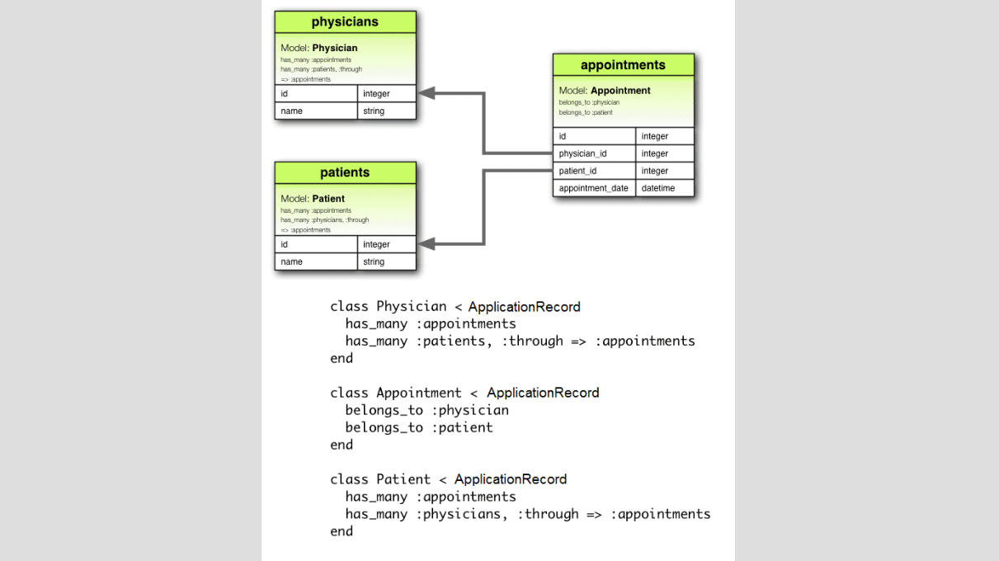

# ead(Entity Association Diagram gem)

## Installation

ead's installation is pretty standard:

```sh
$ gem install ead
```
## Usage

There are two choices to use the generated JSON file;
- Go to the root folder of your Ruby on Rails project.
  ```sh
  $ ead 'path_of_the_generated_file'
  ```
  * Don't forget to put quotation marks(').

- Move the generated JSON file (its name must be 'EAD.json') to the root folder of your project. Then, 
  ```sh
  $ ead
  ```
  * If the name of the generated JSON file isn't 'EAD.json',
  ```sh
  $ ead './name_of_the_file'
  ```
  * Don't forget to put quotation marks(').

⚠️: Save your files before running the gem.

⚠️⚠️: Please double check generated files by the gem.

⚠️⚠️⚠️: EAD is still under development. So, it is not recommended to use this gem with ongoing projects. 



## Built With

- Ruby
- RSpec

## Getting Started


EAD is a tool to initialize any Ruby on Rails project quickly by implementing associations from a generated JSON file.

EAD contains two parts;

- A user interface(called as EAD) to generate JSON file
- A gem(called as EAD gem) to modify the files of Ruby on Rails project by using the generated JSON file

This repository contains code of the EAD gem.

EAD can be accessible from [this repository](https://github.com/ozovalihasan/ead) or [here](https://ead.ozovalihasan.com/) 

## Test EAD

- Clone this repository
- Open terminal
- Change directory by using `cd ead-g`
- Run `bundle install`
- Run `rspec` to test all files

# Authors

Reach out to me at one of the following places!

👤 **Hasan Özovalı**

- Website: [ozovalihasan.com](https://www.ozovalihasan.com/)
- LinkedIn: [Hasan Özovalı](https://www.linkedin.com/in/hasan-ozovali/)
- Github: [@ozovalihasan](https://github.com/ozovalihasan)
- Twitter: [@ozovalihasan](https://twitter.com/ozovalihasan)
- Mail: [ozovalihasan@gmail.com](mailto:ozovalihasan@gmail.com)


## 🤝 Contributing

Contributions, issues and feature requests are welcome!

Feel free to check the [issues page](https://github.com/ozovalihasan/ead-g/issues).

## Show your support

Give a ⭐️ if you like this project!

## License

[](http://badges.mit-license.org)

- **[MIT license](http://opensource.org/licenses/mit-license.php)**
 